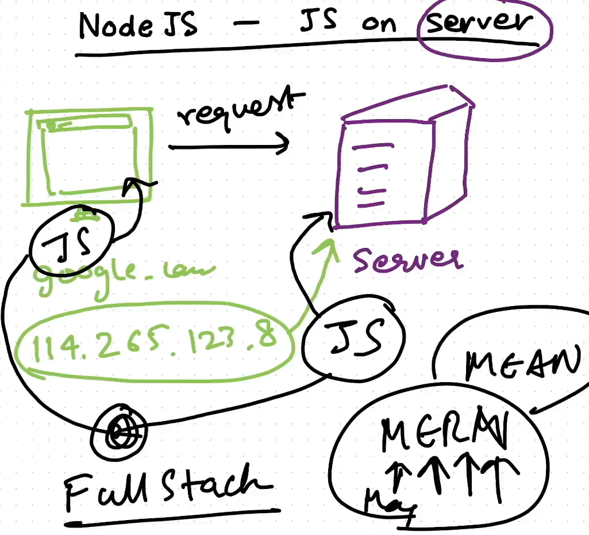

# E02: JS on Server

---

## Popularity of Node

- Earlier,
    - Front-End Developers used to Write Code for Client Side [ JS ]
    - Back-End Developers used to Write Code for Server Side [ Java, Python etc.. ]
    - They both Differ in Languages & Requires lot of knowledge
- Now,
    - JS can be used in Servers with the Help of Node
    - So Both Front-End & Back-End can be written in JS Code & can develop Apps
    - This made Node Popular & gave rise to Full stack technologies like MEAN & MERN

## What is JS Engine..?

- JS Engine == V8 Engine
- V8 Engine is written on C++ ⇒ JS Engine is Written in C++
- Hence, JS Engine is a C++ Program
- Job of V8 Engine → To Execute JS Code
    - i.e., We Run/Execute JS code using C++ Program
    - JS Code is read by & is converted into Machine Code by that C++ Program [ V8 ]
- V8 Can be Embedded into any C++ Application
    - Hence gave raise to Node JS

<aside>
💡

NOTE:

---

- NodeJS is just a C++ App with V8 Embedded into it
    - Since, V8 can be Embedded into any C++ Application
    - This gave Raise to Node JS
</aside>

## Q: Why we need Node JS, when V8 can execute JS..?

- V8 Implements ECMAScript & WebAssembly [ Newly Added ]
    - `ECMAScript` → is a Standard/Rules for Scripting Languages [ JS, JScript, ActionScript etc.. ]
    - Every JS Engine must follow these Standards
        - Standards → Syntax Rules, Compilation/Interpreter Rules etc..
    - V8 Can only Run/Execute the Core JS Code & Nothing Else
- But, Node JS embeds V8 & some extra features [ super powers ]
    - Like Modules, API’s on Server
        - making connections with DB,
        - Sending request to another Sites
        - Can Read File System
    - These cannot be done by a V8 Engine
- Hence, Node JS is Majorly written in JS [ 68%, unlike V8 which is in C++ ] due to these Extra Features
    - But still, Node JS is a C++ Application

## Flow of Execution

- JS is Executed by Node JS [ using V8 Engine ]
    - Here, V8 Engine uses C++ to Convert the JS Code [ HLC ] into Machine Code [ LLC ]
    - This Machine Code will be Executed by Micro Processors like ARM, X86 etc..
    - Finally Output is Generated

---

## difference between Machine code vs Assembly code

- **`Machine Code`**
    - Machine code is the fundamental language that a computer's processor understands directly —> Just 0’s & 1’s
    - It consists of binary digits (0s and 1s) that represent specific instructions for the CPU.
    - Every instruction is tied to a particular CPU architecture,
        - meaning machine code varies between processors.
- **`Assembly Code`**
    - Assembly code is one step/layer above machine code
        - It serves as a human-readable representation of machine code.
    - It uses symbolic operation codes (mnemonics) like `MOV`, `ADD`, or `JMP` instead of raw binary.
    - Assembly code still requires an assembler to translate it into machine code.
    - It is also specific to a particular processor architecture,
        - but easier for programmers to work with than pure machine code.