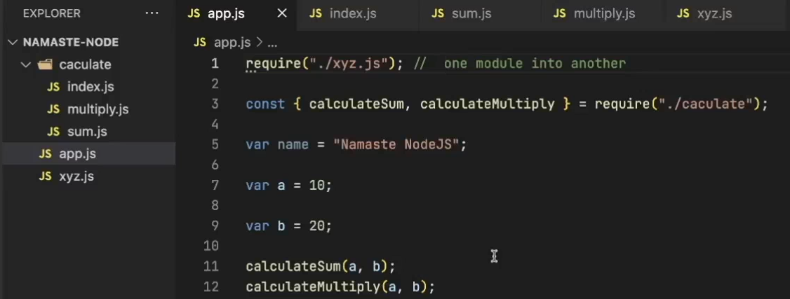

# E04: Modules in JS [ 03/02/2025 ]

---

- Generally, Whole JS Code is written in multiple JS Files
- But we will run only ONE file which is the Entry Point to the App
- Then How come the Code from Other Files will also be Executed
- Using Module System

## Modules

- **`module`** is a file containing code that can be imported and exported into other JavaScript files
    - **`module`** is a way to Organize & Encapsulate the code, by splitting it into separate reusable pieces/files
    - modules makes our code more maintainable, readable, and reusable

<aside>
💡

File (vs) Module:

---

- JS File → Any document which contains JS code
- Module → Any document which JS code that can be exported & imported into other files
</aside>

To include/import any JS Code into Current JS File, we use `require()` function

`require('path')` → used to import modules, JSON, and local files

- It executes the file Specified in the Path
- But by default, It won’t give the Access to the Variables, Functions & Classes to Outside Files/Modules → Those are Encapsulated
    - i.e., By Default, Module PROTECTS their Variables, Functions & Classes from Leaking
    - Hence, Variables, Functions & Classes in a File are NOT Accessible to Outside Files
- To get the Access to those Variables & Functions, we need to export those things using `module.exports` → Export
    - `module.exports` is an Empty Object `{}`
    - To export a Single thing → `module.exports = variable/function`
    - To export Multiple things → `module.exports = { variable/function1, variable/function2 .. }`
- To Access the Exported Variables/Functions in the Current File, we need to store in a Variable → Import
    - `const variable/function = require('path')`
        - This stores all the variables/functions returned by `module.exports`
        - We can use Object De-Structuring if the `module.exports` returns an Object

## Examples

```jsx
// module1.js
require('./02_modules2.js')
console.log("Log Message from Module 1");
```

- Run `node module1.js`
    - 1st module2 log message is printed & then module1’s log msg is printed

```jsx
// module2.js
console.log("This is the Log Message from Module2 File");

function sum (a, b) {
    console.log(a + b);
}
```

Why..?

- Because, `require()` works synchronously, meaning it loads the module before continuing the execution of the code.
- Hence, Once the Code in Module2 is Executed, Then only Module1 will be Executed

```jsx
// module1.js
require('./02_modules2.js')
console.log("Log Message from Module 1");
sum(10, 20);
```

- This will Throw Error

```jsx
// module2.js
console.log("This is the Log Message from Module2 File");

function sum (a, b) {
    console.log(a + b);
}
```

Why..?

- Because, `require()` function only executes the Code, but DOESN’T allows the variables/functions to be accessible outside of the File
- WKT, By default Module Protects it’s Variables & Functions from Leaking → Hence, Variables & Functions are NOT Accessible to Outside Files

```jsx
// module1.js
const calculateSum = require('./02_modules2.js')

console.log("Log Message from Module 1");
calculateSum(10, 20);
```

- This Code Works Now

```jsx
// module2.js
console.log("This is the Log Message from Module2 File");

function sum (a, b) {
    console.log(a + b);
}

module.exports = sum;
```

To Export Multiple Variables/Functions

```jsx
// module1.js
const obj = require('./02_modules2.js')

console.log("Log Message from Module 1");
console.log(obj.marks);
obj.sum(10, 20)
```

- Instead, we can use Object de-structuring also like this

```jsx
const {marks, sum} = require('./02_modules2.js')

console.log(marks);
sum(10, 20)
```

```jsx
// module2.js
console.log("This is the Log Message from Module2 File");

let marks = 99;

function sum (a, b) {
    console.log(a + b);
}

module.exports = {
    marks: marks,
    sum: sum
};
```

Shortcut for `module.exports`

```jsx
module.exports = {
    marks,
    sum
};
```

This is same as  [ Left is Newer Way & Right is Older way ]

```jsx
module.exports = {
    marks: marks,
    sum: sum
};
```

<aside>
💡

NOTE:

---

1. `require()` function only executes the Code, but DOESN’T allows the variables/functions Accessible to outside of the File
2. To Allow the Accessibility of Variables & Functions into Another Files, we need to export those using `module.exports`
3. From ES6 & Later, `import` is preferred over `require()` in front-end code, 
    - but `require()` remains common in Node.js.
    - Why..?
        - Because, By default Node JS uses a Module System called Common JS Module [ CJS ]

In modern JavaScript, modules are typically used with `ES6` or `ECMAScript Modules (ESM)` syntax. 

- To enable modules in a browser, you should use the `type="module"` attribute in the `<script>` tag:

```html
<script type="module" src="app.js"></script>
```

**In Node.js**, the default module system is CommonJS (with `require()`), 

- but ESM is supported in newer versions.
- You can use `import`/`export` by either setting `"type": "module"` in the `package.json` or by using `.mjs` file extensions.
</aside>

## Common JS (vs) ES Module

| Common JS Module  | ES Module  |
| --- | --- |
| Uses `module.exports` to Export  | Uses `export` to Export |
| Uses `require()` function to Import | Uses `import` to Import |
| Older | Newer |
| By Default, Used in Node JS | By Default, Used in Other Libraries & Frameworks [ React, Angular ] |
| Extension → `.cjs` | Extension → `.mjs` |
| `"type" : "commonjs"` | `"type" :"module"` |
| Synchronous  | Asynchronous |
| Runs in Non Strict mode | Runs in Strict Mode |

## NOTE

- `module.exports` is an Empty Object → `{}`
- Hence, we can define it 2 Ways

```jsx
module.exports = {
    marks: marks,
    sum: sum
};
```

```jsx
module.exports.marks = marks
module.exports.sum =  sum
```

Both are Same 

## Folder as a Module

Module can be a file or Folder

There are 2 Ways, we can Import from Multiple files

1. Import individually from each file [ like as seen above ]
2. Import all the files individually from each file into a Single File [ `index.js` ]
    - Then, export that Single file so as to Import it from another file
    - This Helps in Abstraction as well
        - As in this case, `app.js` Won’t even know the location of the sum & multiply functions




- Here, we DON’T require to mention the file `index.js`
- As the Folder `calculate/` itself acts as a Module