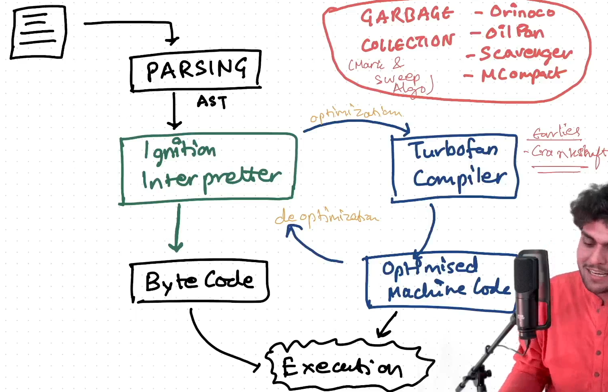

# E08: BTS of V8 Engine

---

## How JS Engine Executes the Code

This Execution is Broken down into several Stages

Stage - 1: PARSING

1. Lexical Analysis [ Tokenization ]
    - Code is broken down into Tokens [ These Token are Similar to Tokens explained in React Class ]
    - JS Engine Executes the Code token by token [ NOT by line by line ]
    - This Step is called Tokenization
2. Syntax Analysis [ Parsing ]
    - Tokens are Converted to AST [ Abstract Syntax Tree ]
    - i.e., AST is generated
    - This Step is called Parsing.
    - Both the above stages can be seen here → [`https://astexplorer.net/`](https://astexplorer.net/)
        - [ Try to Give it a Big Code/Program & See the Generated AST ]

Stage - 2: Interpreter

- Normal Execution
    - JS has both Interpreter & Compiler
    - AST is Passed into Interpreter [ called Ignition Interpreter ]
    - Ignition Interpreter executes the Code line-by-line
    - But, JS also has a compiler [ called Turbo Fan Compiler ]
    - If Ignition Interpreter recognizes any part of Code that is interpreted again & again [ Hence, Optimization is required ]
        - It will send/offload that code to Compiler
        - This Piece of code which is sent for compilation is called Hot Code
        - Turbo Fan Compiler will compiler that piece of code & generates a Machine Code,
        - Now this optimized Machine Code can be executed very fast & any number of times
        - This Compilation boosts the performance of execution
        - This Process is also known as Optimization
    - In this way JS interprets & Compiles the Code for better performance
- De-Optimization
    - Suppose, Hot Code is a sum function which takes 2 integers & returns an integer
    - Now, The Compiler will compile the Code & generate an Optimized Machine Code
    - But this Optimized code will work very Fast as expected only when the arguments are of integer
    - If we pass other types, then this code doesn’t work [ Expected Int But Passed String type ]
    - Hence, De-Optimization is Required & it will de-optimize it
    - which means, this Code will be sent back to Interpreter & is Interpreted but Not compiled
- Similarly, there are other things going on in this stage like
    - Inline Caching
    - Copy Elision
    - Garbage Collection

All these Things are Very Specific to V8 Engine

- Other JS Engines may vary with the above mentioned things
- But the steps are similar

Other’s can work in similar way

## Is JS Interpreted (or) Compiled..?

- JS is neither Interpreted nor Compiled Language, But a Hybrid of both
    - **JavaScript** is **interpreted**, but uses **JIT compilation**
        - **JIT compilation** has made it behave like a **compiled** language in some scenarios, offering a performance boost.
        - `JIT Compiler` typically Analyses the Code [ that is being executed ] & Idenfies the Parts of Code where Speed Up gaied from Compilation/Re-Compilationwould Out Weight the Overhead of Compiling that Code
    - So, it's often described as a **hybrid** of both interpreted and compiled.

| Feature | Interpreter | Compiler |
| --- | --- | --- |
| Translation | Translates the Code Line-by-Line | Translates the Entire Code into Machine Code |
| Execution | Executes the Code line-by-line immediately during Translation | A Separate Executable File is generated, which gets executed  |
| Speed | Slower [ due to runtime translation ] | Faster [ As Translation is already done ] |
| Error Detection | Errors are detected line-by-line during Execution | Errors are detected once compilation/translation is done |

<aside>
💡

NOTE:

---

What is a Syntax Error..?

- When your Code is NOT able to generate Abstract Syntax Tree [ AST ]
- It will throw an Error called Syntax Error [ Which is a Compilation Error, as it occurs at compilation ]
</aside>