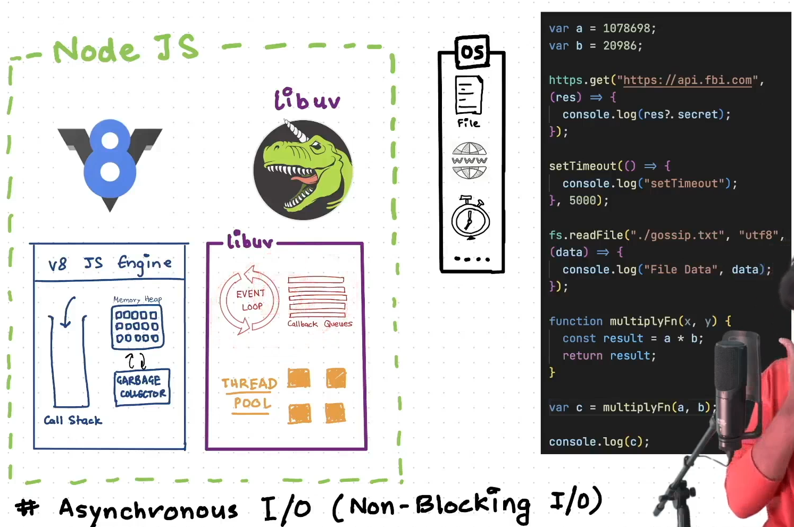

# E09: BTS of libuv

---

`libuv` has 3 Major Things

1. Event Loop
2. Callback Queues
3. Thread Pool

```jsx
setTimeout(() => {
		console.log("Hello World");
}, 3000)
```

- WKT, the JS Engine will offload this Async task to `libuv`
- `libuv`'s job is to handle the Async Task which is executing set timeout function
    - Once the task is finished, i.e., after 3 milliseconds
    - `libuv` needs to send the Callback function back to JS Engine’s Call Stack
    - Once the Callback is in Call Stack, JS Engine will execute the callback quickly
    - NOTE:
        - This callback is sent back to Call Stack only once the Call Stack is Empty
- But, How this happens..?
    - Through Event Loop & Callbacks Queues

Suppose there are 3 Async Tasks

1. API Call
2. File Reading
3. Set Timeout

Let’s assume some scenarios

1. Any one of these tasks are completed, But Call Stack is still Running [ NOT Empty ]
2. All of these tasks are completed at same time, But Call Stack is still Running [ NOT Empty ]
3. All of these tasks are completed at same time, And Call Stack is Empty

What will `libuv` do..?

- This is where Callback Queues & Event Loop comes into Picture

## Callback Queues

- Callback Queues will contain multiple Queues based on the Async Task
- All of the Completed Task will be Sent to respective Callback Queues & will be waited there

## Event Loop

- Event Loop will continuously keep checking for
    1. Call Stack [ whether it is Empty ]
    2. Callback Queues [ whether any of the completed tasks are waiting in the queue ]
- When JS Engine is busy Executing the Call Stack, It will wait & Checks
- Whenever it sees that JS Engine is idle [ Call Stack is Empty ], It will send/load a task from Callback Queues to JS Engine
- Event Loop is Responsible for loading the Tasks from Callback Queues onto JS Engine [ based on Priority ]




## Phases in Event Loop

There are multiple phases in Event Loop, but 4 Major Phases are :

1. Timer → All the Timer related Callbacks
2. Poll → All the I/O related Callbacks [ like FS, API’s ]
    - Most of the Callbacks will happen here [ So V.IMP phase ]
3. Check → Set Immediate Callbacks
4. Close →All the Closable function Callbacks[ like DB Connection, socket connection ]

But before Starting each of these Individual Phases, Event Loop will 1st Execute an Internal Phase 

1. `process.nextTick()` callbacks
2. Promise Callbacks

These callbacks are checked before each individual phase & Executed/loaded onto JS Engine

- i.e., 1st Event Loop will check for Internal Phase
- Then goes to check for Timer Phase
- After that, checks again for Internal Phase
- Then checks for Pool Phase & So on..

NOTE: 

- For All of these above each Phases,
    - There will be a Separate Individual Queues maintained inside Callback Queues [ maintained by `libuv` ]

EX:

Suppose there are some callbacks as described in the pic and all are waiting their respective queues. 

Now, the loading of these callbacks into JS Engine will be like

1. Process & Promise callbacks will be loaded first [ due to Internal Phase ]
2. set Timeout callback will be next [ due to Timer Phase ]
3. As there are NO Process & Promise callbacks, it skips [ due to Internal Phase ]
4. File Read & API callbacks will be loaded next [ due to Poll Phase ]
5. As there are NO Process & Promise callbacks, it skips [ due to Internal Phase ]
6. set Immediate callback will be loaded next [ as part of Check Phase ]
7. As there are NO Process & Promise callbacks, it skips [ due to Internal Phase ]
8. As there are NO closing tasks, it skips [ due to Internal Phase ]

These same steps keeps on executing again & again in a LOOP


Demo EX

The Code will execute in following way:

1. JS Engine will Execute the Call Stack & Prints print-A function & log statement [ as they are sync tasks ]
2. Now, in the Async tasks, 
    1. file reading will be heavier [ as it depends on OS & data inside the file ]
    2. set Immediate & set Timeout are executed immediately by `libuv` & will be waiting in their respective queues
3. As Timer Phase comes 1st, set Timeout will be executed
4. As Check Phase comes next, set Immediate will be executed next [ after set Timeout ]
5. Finally, when the file read operation is done, it will execute it’s callback function [ i.e., loads to Engine ]

NOTE : File Read takes time definitely [ as it will take > 0 milliseconds ]


<aside>
💡

NOTE:

---

- Event Loop in Node JS is a Semi Infinite Loop
- Why..?
    - WKT, Event Loop will be continuously keep checking for Call Stack & Callback Queues
    - Hence, It is an Infinite Loop
    - But, when the Call Stack is Empty & All of the Callback Queues are also Empty
        - i.e., when Event Loop is Idle [ Since Call Stack & Queues are Empty ]
        - Then, Event Loop will wait at Poll Stage
        - Why at Poll Phase..?
            - Once any Async I/O task comes back at poll phase, [ After completing it’s I/O operation ]
            - Then, Event Loop will start executing again [ The same loop again ]
    - As it waits, It is called `Semi Infinite Loop`
- Only Node JS’s Event Loop is Semi Infinite Loop
- But This Node JS’s Event Loop is Different from Browser’s Event Loop [ Browser’s Event Loop is Infinite ]
</aside>

**V.IMP Ex**

When the Program Starts, JS Engine will execute in following way

1. Set Immediate function is an Async → Offload it ⇒ Process A
2. Set Timeout function is an Async → Offload it ⇒ Process B
3. Promise is an Async → Offload it ⇒ Process C
4. File Read is an Async → Offload it ⇒ Process D 
    - This takes more time where as others are Immediately Executed
5. Process is an Async → Offload it ⇒ Process E
6. log is a Sync function → Execute it ⇒ Prints on Console
7. Now the Call Stack is Empty & A. B. D, E are waiting in Queue [ Since they are executed Immediately ]
8. According to Event Loop Phases
    1. Process is executed 1st
    2. Promise is executed next
    3. set timeout is next
    4. set Immediate is last
9. Now assume that, Event Loop is Idle as Call Stack & Queues are Empty
10. So Event Loop will wait at Pool Phase & execute the file read callback
11. Here in Pool Phase callback function execution, 
    1. JS Engine sees Async functions again, So offloads those Async tasks
    2. Prints the log message 1st [ as it is Sync Task ]


1. This is V.IMP Step, as the Call Stack is Empty, Event Loop loads the Async tasks
2. But Here, Event Loop RESUMES execution from Poll Phase, NOT from Start onwards
    1. Hence, Process will be executed 1st [ from Async Tasks ]
    2. Promise is next 
    3. Set Immediate is Next
    4. Finally Set Timeout [ This is V.IMP ].

<aside>
💡

NOTE:

---

- If there are nested Process Tasks,
- Then Event Loop will give this High Priority Process Tasks even high Priority & Executes all the Nested Tasks
    - But here as well, Async tasks are executed only after Call Stack is Empty
- This happens the same in Promises as well
- Hence, Promises chaining executes in that way
</aside>

V.IMP Ex

```jsx
const fs = require("node:fs");

setImmediate(() => console.log("setImmediate"));

setTimeout(() => console.log("Timer expired"), 0);

Promise.resolve(("Promise")).then(console. log);

fs.readFile("./07_file.txt", "utf8", () => {
    console.log("File Reading CB");
})

process. nextTick(() => {
    process.nextTick(() => console.log("inner nextTick"));
    console. log("nextTick");
})

console.log("Last line of the file.");
```