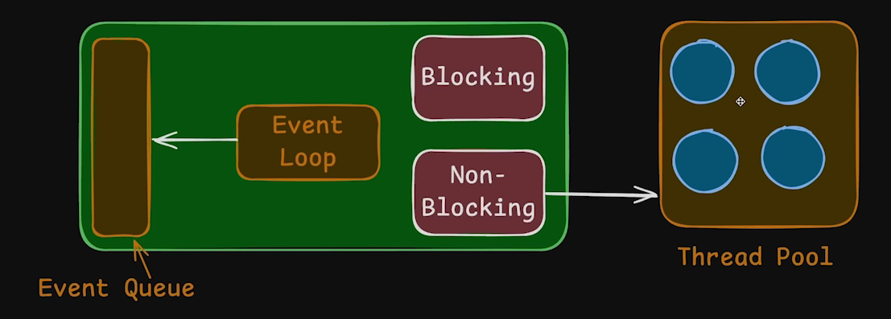

# 2.4 Blocking & Non-Blocking in FS module [ 23/08/2025 ]

---

## Differences in Package Names

- `require ('fs')`
    - This is General way of importing a module in Node
    - WKT, `fs` is a Built-In Module of Node
        - But what if in future , somebody creates a module with `fs` name
        - Hence Namespace modules are introduced in newer versions of Node
- `require ('node:fs')`
    - This tells that, the module is a Built-In Module
- `require ('math')`
    - This tells that, the module may be a Built in module ( or ) a 3rd party Module
    - But `require ('node:math')` → this is definitely a Built-in Module
- `require ('./compress.js')`
    - This tells that, the module is a Custom Module

## fs Module

```jsx
const fs = require('node:fs');

fs.mkdirSync('games');
//  This Creates a Directory

fs.mkdirSync('play/ps5/uncharted', {recursive: true});
//  This Creates a Nested Directories

const contents = fs.readFileSync('./01HelloNode.js', 'utf-8')
// This Reads the mentioned file & returns it content as String

console.log(contents);

fs.writeFileSync('hello.txt', 'Hello Node JS', 'utf-8')
// This Creates a new File with mentioned name & content
// But, this function always Overwrites the data [ Hence writeFile ]

fs.writeFileSync('hello.txt', HelloNode.js, 'utf-8')
// This Copies the contents of "HelloNode.js" into "helo.txt"

fs.appendFileSync('hello.txt', 'Hello Node JS', 'utf-8')
// This Creates a new File with mentioned name & content
// But, This Appends the content [ doesn't overwrite]

fs.unlinkSync('hello.txt');
// This Deletes the File
```

<aside>
💡

NOTE:

---

- Every function will have 2 types
    1. Normal function → `fs.writeFile()` → Non-Blocking Code
    2. Sync function → `fs.writeFileSync()` → Blocking code
</aside>

## Blocking ( vs ) Non-Blocking

- Blocking code **waits** until an operation completes before moving on to the next line of code.
    - It BLOCKS the execution thread.
- Non-blocking code initiates an operation and **moves on immediately. [** to the next line of code ]
    - It uses callbacks, promises, or async/await to handle the result later.
    - It DOESN’T **blocks** the execution thread.

<aside>
💡

NOTE:

---

- Blocking & Non-Blocking are CPU/Thread Behavior
- Sync & Async are Code Execution Behavior

All asynchronous code is **non-blocking by behavior**, 

but not all non-blocking operations are async 

</aside>

## Analogy

- **Blocking**: A waiter takes your order and stands there waiting until your food is ready before serving the next table.
- **Non-blocking**: A waiter takes your order, sends it to the kitchen, and serves other tables while waiting.
- **Asynchronous**: The kitchen rings a bell when your food is ready, and the waiter brings it when notified.

Example

```jsx
const fs = require('node:fs');

console.log("Start of Execution Line");

const contents = fs.readFileSync('02fs.js', 'utf-8');
console.log("Contents of File :", contents);
// What if the file is of 1TB size. 
// Suppose It takes 1min time -> until that time Thread is blocked
// Execution doesn't move to next line of Code 
// as it is blocked by fs read operation

console.log("End of Execution Line");
```

```jsx
const fs = require('node:fs');

console.log("Start of Execution Line");

const nonBlockingContents = fs.readFile('02fs.js', 'utf-8', function (err, data) {
    if (err) console.log("Error :", err);
    else console.log("Contents of File :", data)
})
// This is Non-Blocking Code
// It uses callback function to handle the data later 

console.log("End of Execution Line");
```

## Behind the Scenes




Event Loop sends the Requests from Users to Execution based on Blocking/Non-Blocking code

- Green Orbs are Satisfied Users [ where they got the Response back ]
- Red ones are still waiting for Response [ which is currently being executed by one of the Worker Node in Thread Pool ]