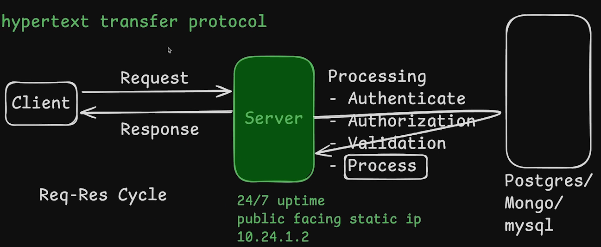

# 4.1 Intro to HTTP Protocol [ 24/08/2025 ]

---

## Request Response Cycle



- `Client` → A Machine which requests the data
- `Server` → A Machine which gives response to that incoming request
    - It takes incoming request → Process it → Send back the response
    - It will be 24/7 Online
    - It will have public static IP
- Client will request the data → Server will process it & send back the Response
    - This is called Request Response Cycle

## Role of Backend Dev

- We have to Create Servers
- i.e., Create a Machine which is able to Handle the Incoming Request
    - Accept the Request
    - Process the Request
    - and send back the Response

## HTTP

- HTTP → Hypertext Transfer Protocol)
- HTTP → A Protocol used to transfer/Communicate the data over the Internet
    - It allows users (clients) to communicate with web servers [ to access and manage resources (webpages, files, APIs, etc.) ]
- HTTP will have
    1. Methods [ GET, POST, DELETE etc.. ] → Seen in Client’s Request
    2. Status Code [ 200, 402 etc.. ] → Seen in Server’s Response

HTTP Methods

- **HTTP method** → Describes the type of **action** you want to perform on a server
    - GET → When client want to get some data from server
        - See all the tweets, watch video, see comments
    - POST → when client want to send some data to server
        - Create a tweet, upload a video, create a comment
    - PUT → When client wants to update some existing data
    - DELETE → When client wants to delete some data

HTTP Status Codes

- Status Codes → It Describes the type of Response [ like success, error, redirected  etc.. ] to Client
- It ranges from [ 100 to 599 ]
    - 1xx - Info Response
    2xx - Success
    3xx - Redirect
    4xx - Client Error
    5xx - Server Error
    - 200 - OK
    201 - OK and created
    301 - Redirect
    400 - Bad Request
    404 - Not Found
    500 - Server Error

```jsx
Client ----- Request (Method + URL + Headers)   ----> Server
Clinet <---- Response (Status + Headers + Body) ----- Server
```

## `node:http`

- This module allows you to create a basic web server.

```jsx
// Importing Built-in HTTP Module
const http = require('node:http');

// creates an HTTP server instance [ Object ]
const server = http.createServer();

// Making Server listen for incoming connections on port 8000.
server.listen(8000, () => {
    console.log("Server is Listening on port 8000");
})
// callback function that runs once the server successfully starts.
```

- As you can see, we don’t have a Request Handler here
    - Hence, server will keep on listening only with No responses for Requests
    - i.e., it keeps on loading

Adding Request Handler

- We can Add request handler in the `http.createServer()` itself using a callback fn

```jsx
// Importing Built-in HTTP Module
const http = require('node:http');

// creates an HTTP server instance [ Object ]
const server = http.createServer((req, res) => {
    console.log("I got an Incoming Request");
    // logs message to console every time the server receives a request.

    res.writeHead(200);
    // Sends an HTTP status code 200 OK to the client.

    res.end("Thank you for visiting the Server");
    // Ends the response.
    // And Sends "Thank you for visiting the Server" back to client
});

// Making Server listen for incoming connections on port 8000.
server.listen(8000, () => {
    console.log("Server is Listening on port 8000");
})
// callback function that runs once the server successfully starts.
```

`res.writeHead(statusCode, headers)`

- Sets the **HTTP response status code** and **response headers**.
    - Status is Mandatory
    - Headers is Optional
    
    ```jsx
    res.writeHead(200, {'Content-Type': 'text/plain'});
    // Sends back 200 OK
    // Tells the browser: “I’m sending you plain text”
    ```
    

`res.end([body_data])`

- Ends the response and optionally sends the **final data** (the response body).
- Once you call `res.end()`, the server is done responding to that request.

## What is a Port ?

- Why Port ?
    - WKT, whenever an Application from one computer wants to send data to another Application of a different computer
        - It send data using IP Address or  MAC Address
        - But, How does our computer knows that this data is for a specific application and this data is sent by any specific application?
        - Here comes the concept of Port
            - data is first received using their IP or MAC address [ by a computer ]
            - then it is delivered to the application whose port number is with the data packets.
- `port` → *is a logical address [ of a 16-bit unsigned integer ] that is allotted to every application on a computer*
    - *It uses the internet to send or receive data.*
    - To find the Machine → use IP Address [ it’s like Finding a Hotel Address ]
    - To find the Specific App on a Computer → Use Port No [ It’s like Finding a Room inside the Hotel ]

Importance:

- **Identification of service [ like Process/Application ]**
- **Efficient Data Routing [ to the respective Application ]**
- **Block traffic from specific applications**

## Can two servers use the same port?

- **No**, [ not on the same IP address ]
    - Only **one process** can listen to a specific port at a time.
    - If two try to use the same port, you'll get an error like: