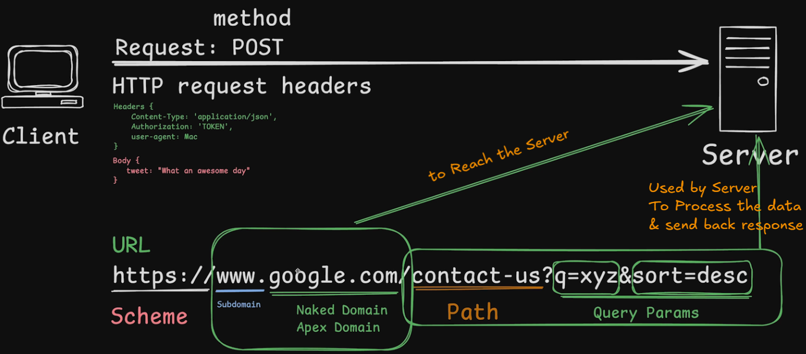

# 4.2 Deep Dive into HTTP [ 24/08/2025 ]

---

## HTTP request

- HTTP Request → A request made by Client via HTTP Protocol
    - HTTP → A Protocol used to communicate the data over the Internet
- Every HTTP request will contain some data
    - HTTP Version
    - HTTP request URL
    - HTTP request Method → Describes the type of **action** you want to perform on a server
    - HTTP request Headers  → Contains the data/info about the Request
    - HTTP request Body [ Optional ] → Contains the data to be sent to Server [ Used in POST method ]

`URL` → Uniform Resource Locator

- A **URL is a complete address** for accessing a specific resource on the internet.
    - It is used to **uniquely identify and locate** a specific resource. [ as internet is massive ]
    - Where as IP Address is used to **uniquely identify and locate** a specific Machine

HTTP Request Diagram



## HTTP Response

- HTTP Response → A Response send back to Client via HTTP Protocol
- Every HTTP response will contain some data
    - HTTP Status Code
    - HTTP Response Header → information about the response
    - HTTP Response Body → Actual data [ seen & requested by Client ]

## HTTP request & response example

```jsx
const http = require('node:http');

const server = http.createServer((req, res) => {
    // HTTP Request 
    console.log("A Request is made");
    console.log(req.httpVersion);
    console.log(req.url);
    console.log(req.method);
    console.log(req.headers);
    
    // HTTP Response
    res.writeHead(200);
    res.end("Reques is closed now");
});

server.listen(8000, () => {
    console.log("Server is Listening on Port No. : 8000");
})
```

## Actual Small Server

```jsx
const http = require('node:http');

const server = http.createServer((req, res) => {
    // HTTP Request 
    console.log("A Request is made");

    
    
    switch (req.url) {
        case ('/') :
            res.writeHead(200);
            res.end("Welcome to Home Page");
            break;
        case ('/contact'):
            res.writeHead(200);
            res.end('Contact me @ xyz.gamil.com');
            break;
        case ('/about'):
            res.writeHead(200);
            res.end("I'm a Software Engineer");
            break;
        default:
            res.writeHead(400);
            res.end("You are Lost ..!");
            break;
    }
});

server.listen(8000, () => {
    console.log("Server is Listening on Port No. : 8000");
})
```