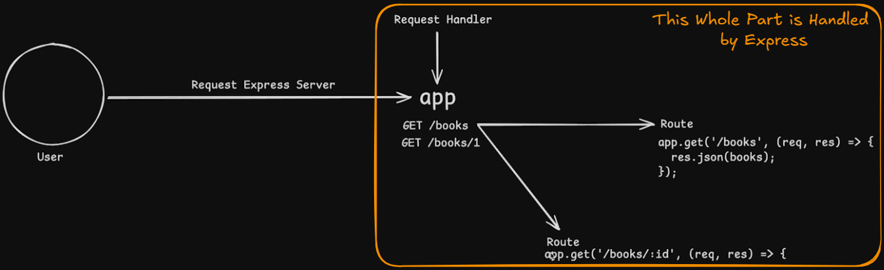

# 6.1 Middleware [ 26/08/2025 ]

---

## Request Flow

- User will make a HTTP Request to Express Server
- Express lets us create an App Object, which then Request goes through the app Object
- app reads that Incoming HTTP Request
    - Type of the Request [ like GET, POST etc.. ]
    - PATH of the Request
- Then based on Type & Path
    - app will smartly Figures out & Identify to which Route the Request should Go
    - Then app will redirect the Request to Respective Route [ Code Block ]
    - Route will send back the Response using the Route Handler [ callback function ]
- This Whole Thing is Handled by Express Internally

Summary:

- User Makes the Request
- Request goes to app
- app smartly redirects the Request to respective Router [ Route Handler ]



Now, Express will allow us to Define a Custom Middleware between App & Route Handler

- Now, Instead of redirecting the Request from app to Router [ Route Handler ]
    - Request is Redirected to this Custom Middleware
    - Then Middleware will Internally do something [ based on Code execution ]
    - Then finally Request will be sent to Router
- Custom Middleware is a Piece of Code that can do anything
- Now, This Middleware Intercepts the Request and sits in the Middle of app & Router


## Middleware

- Middleware lets us Intercepts the Incoming Request [ between app & Route ] & execute some Custom Piece of Code
- `Middleware` is the Piece of Code that sits between app & Route and runs in every Request
    - After Executing this Piece of Code, It is then Forwarded to Route

`Middleware Function` → Function which have access to Req Object, Res Object & next function [ in the Req-Res Cycle ]

- next function refers to the next middleware function

Middleware’s can do Following things

- It can READ the Request [ → It has Full Access to Request Object ]
- It can TERMINATE the Request [ → Hence Terminating Request-Response Cycle ]
- It can FORWARD the Request to Other Middleware’s

We can have N number of Middleware’s

Middleware’s Always RUN in Sequence [ As JS is Synchronous ]

- i.e., It can Either Terminate the Req ( or ) Forward the Req to Next Middleware
- But Cannot Forward directly to any Other Middleware in the sequence


<aside>
💡

NOTE:

---

```jsx
app.use(express.json());
// If Headers has content-type = application/json
// Then parse it to json & store in req.body
// Finally call the next() function [ This is default behavior ]

// If this line is NOT used, Then req.body = undefined
```

</aside>

EX-1: Req halted by Middleware

```jsx
const express = require('express');

const app = express();
const PORT = 8000;

app.use(function (req, res, next) {
    console.log("This is Middleware A");
})
// This Middleware function will Intercept all the incoming requests & halts
// It neither terminate the req nor forwards
// Hence, Server will continuously load [ for any Req ]

app.get('/books', (req, res) => {
    res.json({id:'1', name:"Modern NodeJS", author:"Paris Hilton"});
}) 

app.listen(PORT, () => console.log(`Server is Running on PORT : ${PORT}`));
```

```jsx
const express = require('express');

const app = express();
const PORT = 8000;

app.use(function (req, res) {
    console.log("This is Middleware A");
})
// By default, Any Middleware won't invoke next() automatcially
// We need to explicitly invoke it

app.get('/books', (req, res) => {
    res.json({id:'1', name:"Modern NodeJS", author:"Paris Hilton"});
}) 

app.listen(PORT, () => console.log(`Server is Running on PORT : ${PORT}`));
```

<aside>
💡

NOTE:

---

Point-1

- By default, Any Middleware won't invoke “next function” automatically
- We need to explicitly invoke it using `next()`

Point-2

- In Route Handlers ( or ) in Middleware’s,
    - Function don’t need to return [ it is optional ]
    - as we send response using res object
</aside>

EX-2: Req Forward & Terminated by Middleware

```jsx
const express = require('express');

const app = express();
const PORT = 8000;

app.use(function (req, res, next) {
    console.log("This is Middleware A");
    next();
})
// This will execute the code -> Print log msg
// Finally forward the control to next middleware

app.use(function (req, res, next) {
    console.log("This is Middleware B");
    res.end("Request is Terminated");
})
// This Middleware will be Terminate all the Requests
// All Req's won't be reachhing the Route's

app.get('/books', (req, res) => {
    res.json({id:'1', name:"Modern NodeJS", author:"Paris Hilton"});
}) 

app.listen(PORT, () => console.log(`Server is Running on PORT : ${PORT}`));
```

```jsx
		// CASE-1
app.use(function (req, res, next) {
    console.log("This is Middleware B");
    res.end("Request is Terminated");
    next();
})

app.get('/books', (req, res) => {
    res.json({id:'1', name:"Modern NodeJS", author:"Paris Hilton"});
}) 

		// CASE-2
app.use(function (req, res, next) {
    console.log("This is Middleware B");
    res.json("Request is Terminated");
    next();
})

app.get('/books', (req, res) => {
    res.json({id:'1', name:"Modern NodeJS", author:"Paris Hilton"});
}) 

// Both Cases THROWS ERROR
// As we are "setting headers after they are sent to the client"
```

EX-3: Req forward to Respective Route’s

```jsx
const express = require('express');

const app = express();
const PORT = 8000;

app.use(express.json());
// If Headers has content-type = application/json
// Then parse it to json & store in req.body
// Finally call the next() function [ This is default behavior ]

app.use(function (req, res, next) {
    console.log("This is Middleware A");
    next();
})
// This will execute the code -> Print log msg
// Finally forward the control to next middleware

app.use(function (req, res, next) {
    console.log("This is Middleware B");
    next()
})
// This Middleware will be Terminate all the Requests
// All Req's won't be reachhing the Route's

app.get('/books', (req, res) => {
    res.json({id:'1', name:"Modern NodeJS", author:"Paris Hilton"});
}) 

app.post('/books', (req, res) => {
    console.log(req.body);
    res.status(201).json(req.body);
})

app.listen(PORT, () => console.log(`Server is Running on PORT : ${PORT}`));
```