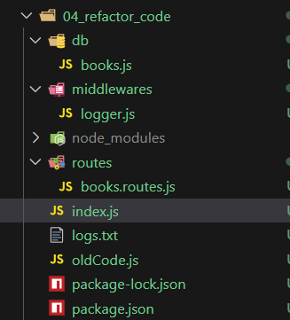

# 6.3 Refactor Code [ 26/05/2025 ]

---

## Original Code

```jsx
const express = require('express');
const fs = require('node:fs');

const app = express();
const PORT = 8000;

const books = [
        { id: 1, title: 'Book One', author: 'Author One' },
        { id: 2, title: 'Book Two', author: 'Author Two' },
];

function loggerMiddleware (req, res, next) {
    const logMessage = `[${Date.now()}]: ${req.method} ${req.path} \n`
    fs.appendFileSync('logs.txt', logMessage, 'utf-8');
    next()
}

// To Parse & Store the req data 
app.use(express.json());

// Middleware fn to log every request
app.use(loggerMiddleware);

// Route to GET all Books
app.get('/books', (req, res) => {
    res.json(books);
})

// Route to fetch a Book by ID
app.get('/books/:id', (req, res) => {
    const id = parseInt(req.params.id);
    
    // send response if ID is NAN
    if (isNaN(id)) {
        return res.status(400).json({error: "Book ID must be of Type Number"});
    }

    // Find the book
    const book = books.find((i) => {return i.id === id});

    // if book not found
    if (!book) {
        return res.status(404).json({error: `Book with id:${id} is NOT found`});
    }

    // Send response
    return res.json(book);
})

// Route to POST a New Book
app.post('/books', (req, res) => {
    const {title, author} = req.body;

    // Condition where title or author is missing in Req
    if (!title) {
        return res.status(400).json({error: "title of the book is Missing"});
    }
    if (!author) {
        return res.status(400).json({error: "author of the book is Missing"});
    }
    
    const id = books.length + 1;
    const book = {id, title, author};
    books.push(book);

    return res.status(201).json({Message: `Book with id:${id} is Inserted`});
})

// Route to DELETE a Book by ID
app.delete('/books/:id', (req, res) => {
    const id = parseInt(req.params.id);
    
    // send response if ID is NAN
    if (isNaN(id)) {
        return res.status(400).json({error: "Book ID must be of Type Number"});
    }

    // Find the book
    const indexToDelete = books.findIndex((i) => {return i.id === id});

    // if book not found
    if (indexToDelete < 0) {
        return res.status(404).json({error: `Book with id:${id} is NOT found`});
    }

    books.splice(indexToDelete, 1);
    return res.json({Message: `Book with id:${id} is Deleted Successfully`});
})

app.listen(PORT, () => console.log(`Server is Running on PORT: ${PORT}`));
```

## Refactoring Code

Step-1 :

- Make a `routes` directory & a file `books.routes.js` inside it
- Create `router` function using `express.Router()`
- Cut all the Routes from `index.js` & Paste it inside this file
    - replace all of `app` with `router`
    - Replace all the `/books` path with `/` in all of the Routes
        - as `/books` is Common in all PATHS
- Now import the `router`  as  `booksRouter` ,
- So, we will write a line in `index.js` as → `app.use('/books', booksRouter)`

Step-2 :

- Create a `db` folder & a file `books.js` inside it → To Store Books data
- CUT the `books` array from `index.js` & paste it inside this file
- export it & import it `books.routes.js` file

Step-3:

- Create a `middlewares` folder & a file `logger.js` inside it → To Store Middleware data
- Cut the `loggerMiddleware` from `index.js` & paste in this file
- export  & Import the `loggerMiddleware` in `index.js`

```jsx
// index.js
const express = require('express');
const booksRouter = require('./routes/books.routes');
const loggerMiddleware = require('./middlewares/logger');

const app = express();
const PORT = 8000;

// To Parse & Store the req data 
app.use(express.json());

// Middleware fn to log every request
app.use(loggerMiddleware);

// Routing all Requests
app.use('/books', booksRouter);

app.listen(PORT, () => console.log(`Server is Running on: ${PORT}`));
```

```jsx
// books.js 
const books = [
		{ id: 1, title: 'Book One', author: 'Author One' },
		{ id: 2, title: 'Book Two', author: 'Author Two' },
];

// Exporting the Books
module.exports = books;
```

```jsx
// logger.js
const fs = require('node:fs');

function loggerMiddleware (req, res, next) {
    const logMessage = `[${Date.now()}]: ${req.method} ${req.path}\n`
    fs.appendFileSync('logs.txt', logMessage, 'utf-8');
    next()
}

module.exports = loggerMiddleware;
```

Folder Strucure



```jsx
// books.routes.js FILE
const express = require('express');
const BOOKS = require('../db/books');

// Creating the Router
const router = express.Router();

// Route to GET all Books
router.get('/', (req, res) => {
    res.json(BOOKS);
})

// Route to fetch a Book by ID
router.get('/:id', (req, res) => {
    const id = parseInt(req.params.id);
    
    // send response if ID is NAN
    if (isNaN(id)) {
        return res.status(400).json({error: "Book ID must be of Type Number"});
    }

    // Find the book
    const book = BOOKS.find((i) => {return i.id === id});

    // if book not found
    if (!book) {
        return res.status(404).json({error: `Book with id:${id} is NOT found`});
    }

    // Send response
    return res.json(book);
})

// Route to POST a New Book
router.post('/', (req, res) => {
    const {title, author} = req.body;

    // Condition where title or author is missing in Req
    if (!title) {
        return res.status(400).json({error: "title of the book is Missing"});
    }
    if (!author) {
        return res.status(400).json({error: "author of the book is Missing"});
    }
    
    const id = BOOKS.length + 1;
    const book = {id, title, author};
    BOOKS.push(book);

    return res.status(201).json({Message: `Book with id:${id} is Inserted`});
})

// Route to DELETE a Book by ID
router.delete('/:id', (req, res) => {
    const id = parseInt(req.params.id);
    
    // send response if ID is NAN
    if (isNaN(id)) {
        return res.status(400).json({error: "Book ID must be of Type Number"});
    }

    // Find the book
    const indexToDelete = BOOKS.findIndex((i) => {return i.id === id});

    // if book not found
    if (indexToDelete < 0) {
        return res.status(404).json({error: `Book with id:${id} is NOT found`});
    }

    BOOKS.splice(indexToDelete, 1);
    return res.json({Message: `Book with id:${id} is Deleted Successfully`});
})

// Exporting the Router
module.exports = router;
```