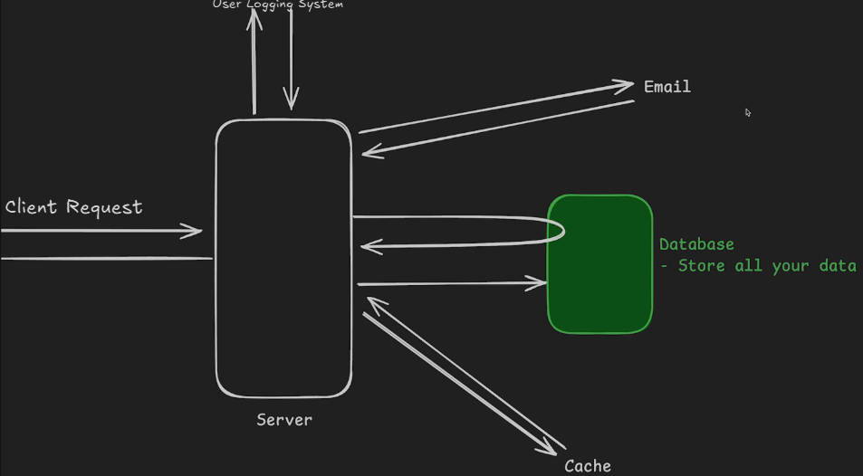

# 7.1 Intro to DB [ 27/08/2025 ]

---

## HTTP Request

- WKT, When an User makes a Request,
- Server will take up the Request, Process it & finally send back Response
- This Processing the Request may include
    - Check the User Logging System
    - Trigger some external Services like Email Verification
    - Interacting with DB
    - Using the Cache Services
- Controller may have to do these many things for just a Single Request
    - Out of these many things, Interacting with DB is the MOST COMMON thing
    - We Interact with DB majority of times & DB itself is a Huge Service
    - Hence, knowledge about this DB service is MUST for a Backend Dev

## SQL ( vs ) NoSQL

| **Feature** | **SQL (Relational Databases)** | **NoSQL (Non-Relational Databases)** |
| --- | --- | --- |
| **Data Model** | Structured Data (tables with rows & columns) | Non-Structured Flexible Data (documents, key-value, wide-column, graph) |
| **Schema** | Fixed schema — predefined structure | often Schema-less (or)
Dynamic schema — structure can vary |
| **Scalability** | Vertical scaling (scale-up: bigger server) | Horizontal scaling (scale-out: more servers) |
| **Transactions** | ACID-compliant (strong consistency) | Often BASE-compliant (eventual consistency) |
| **Query Language** | SQL (Structured Query Language) | Varies (e.g., MongoDB uses BSON queries) |
| **Best For** | Complex queries, structured data, joins | Unstructured/semi-structured data, big data, fast changes |
| **Relationships** | Excellent support for joins and foreign keys | Limited or manual relationship management |
| **Use Cases** | Banking, ERP, CRM, traditional business apps | Real-time analytics, IoT, mobile apps, content management |
| **Examples** | MySQL, PostgreSQL, Oracle, SQL Server | MongoDB, Cassandra, Redis, Couchbase, DynamoDB |

In SQL, some Data Validated are performed at DB Level

In NoSQL, Validations are performed at App Level

## ORM

- ORM → Object Relation Mapping
- It's a programming technique used to interact with relational databases Data using OOP’s Objects
    - Hence, we don’t have to write Complex SQL queries
    - ORM will internally convert OOP’s Objects to SQL Queries & vice versa
- Simply,
    - ORM lets us to use your programming language (e.g., Python, Java) to interact with a database without writing raw SQL queries.
- EX:
    - Drizzle → ORM for JS & SQL [ Postgres & MySQL ]
    - Prisma → ORM for JS & SQL [ Postgres & MySQL ], NoSQL [ MongoDB ]

🧠 What ORM Does

- **Bridges two worlds**: It serves as a Bridge between object-oriented programming (OOP) & relational databases.
- **Maps classes to tables**: Each class in your code corresponds to a table in the database.
- **Maps objects to rows**: Each object is like a row in that table.
- **Handles CRUD operations**: You can create, read, update, and delete records using methods and properties instead of SQL.

✅ Benefits

- **Cleaner code**: More readable and maintainable.
- **Database abstraction**: You can switch databases with minimal changes.
- **Security**: Helps prevent SQL injection.
- **Productivity**: Faster development with less boilerplate.

